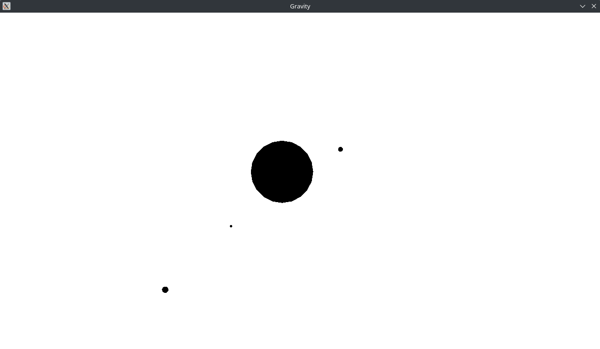
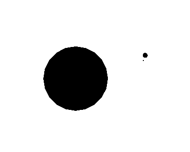
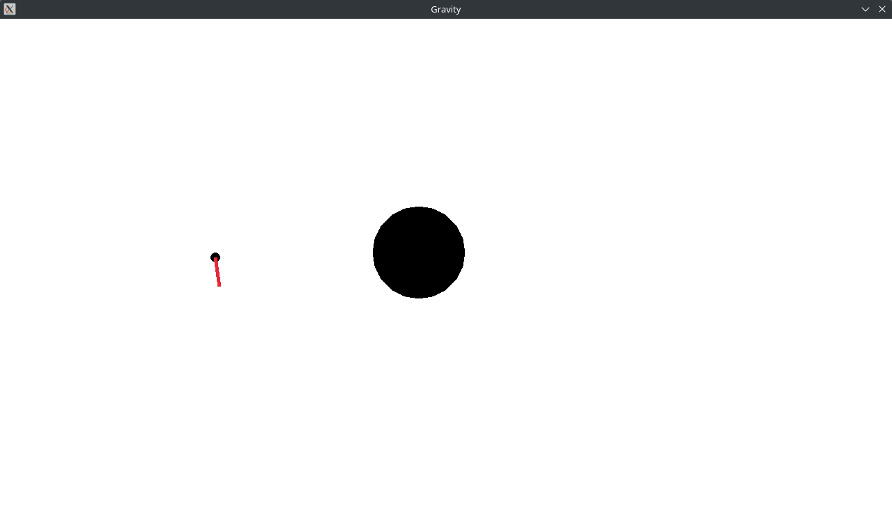

# A basic planet/gravity simulator
Written in rust using macroquad.
 
## How to use it
You can click anywhere to spawn a new planet, then you can move your mouse to change the size.
After that, the red line indicates the planets initial velocity with a longer line meaning more initial velocity.
 

